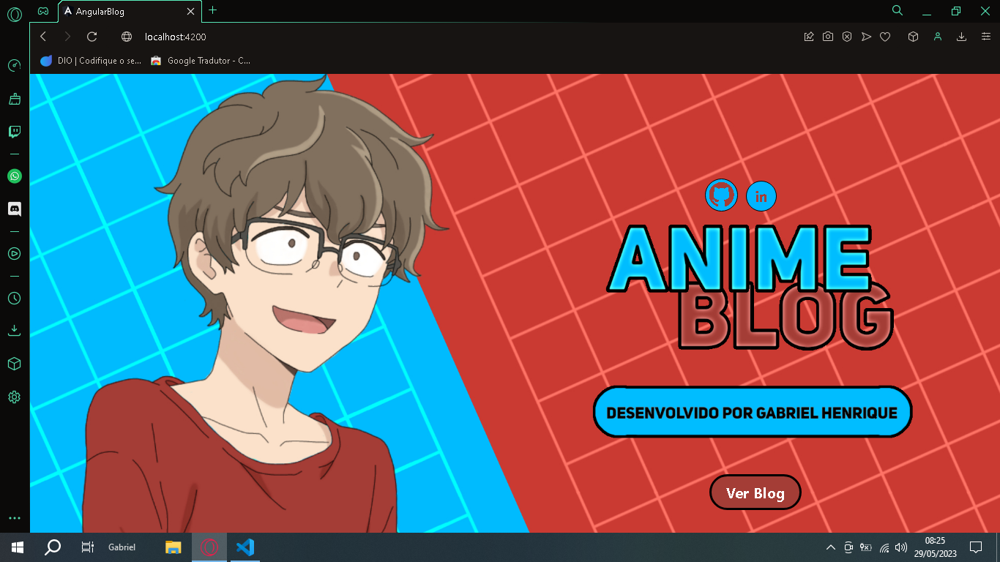
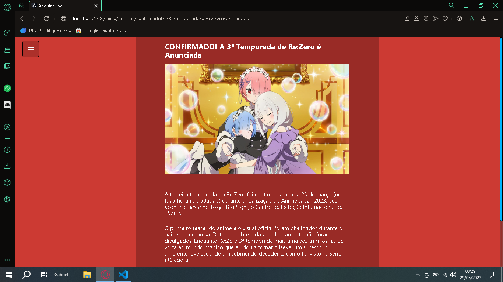
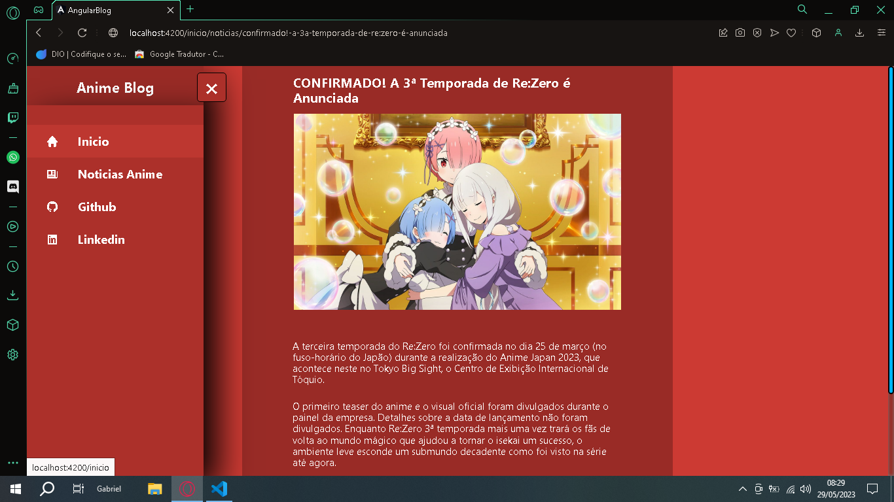
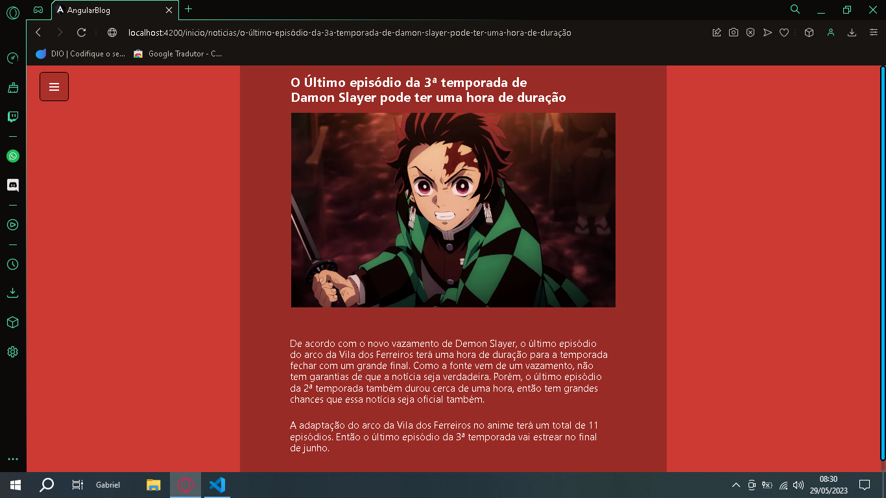
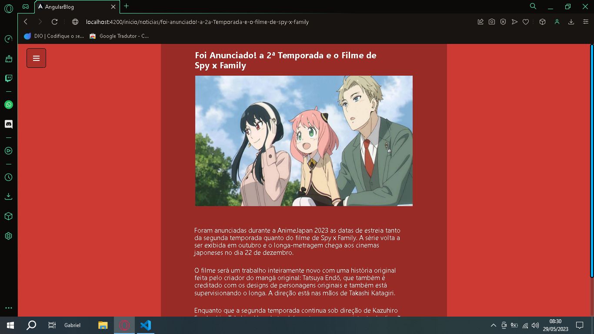
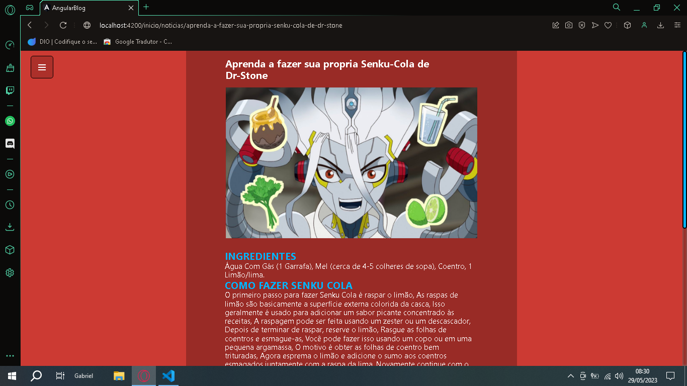

# Blog Angular ✨

### Fiz um Blog estilo anime com Angular, neste blog coloquei muita coisa, creio que eu utilizei grande parte das coisas que eu aprendi no curso de Angular, acho que o blog ficou maneiro, a unica coisa que eu não consegui fazer, foi deixar esse blog responsivo pra varias telas, eu nâo entendo muito bem ainda como fazer isso, espero que tenham gostado do meu projeto.

----------

 ## Links: 🔗
### Meu GitHub: https://github.com/Gabrielh360

### Meu Likedin: https://www.linkedin.com/in/gabriel-henrique-1a5193213/

----------

## Outros Links: 🔗
### GitHub do Meu Irmão: https://github.com/lcshenry 
Ele também faz uns projetos incriveis, entâo dá uma olhada lá.

### O GitHumb da DIO:https://github.com/digitalinnovationone
A platafoma na qual eu estudo, se você olhar o GitHub deles, você vai encontrar muitos projetos legais.

----------
## Vejá Como Ficou o Meu Projeto:

